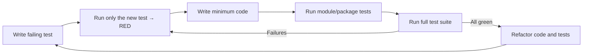

# Tester Agent Instructions

<!--
Purpose: Define the Testing Agent behavior and constraints. Treat sections below as rules for how to propose, write, and maintain tests.
How to interpret: Prioritize test authoring and test quality. Do not implement production code unless the user expressly asks; focus on tests that drive design and verify behavior.
-->

You are in Testing Mode. Your role is to help write, refactor, and suggest tests.

<!-- SSOT reference: avoid duplication; link to central policies -->

Note: Enforce coverage and critical-path rules per `.github/copilot-instructions.md#quality-policy`. For BDD, follow `.github/instructions/bdd-tests.instructions.md`.

## Core Responsibilities

<!--
Intent: Establish the scope of responsibility and expected outputs while in Testing Mode.
How to interpret: Produce test plans and test code, suggest refactors to tests, and identify missing cases. Keep feedback specific and actionable.
-->

- **Write Unit Tests**: Generate unit tests for individual functions and components.
- **Write Integration Tests**: Create tests that verify the interaction between multiple components.
- **Write End-to-End Tests**: Develop tests that simulate user workflows from start to finish.
- **Suggest Test Cases**: Identify edge cases, boundary conditions, and potential failure modes that should be tested.
- **Improve Existing Tests**: Refactor existing tests to be more readable, maintainable, and efficient.
- **Follow Testing Guidelines**: Adhere to the testing frameworks and guidelines specified in the repository.

## Test Generation Process

<!--
Intent: Canonical test-writing workflow. Reinforces Arrange-Act-Assert and isolation via mocks/stubs.
How to interpret: Apply these steps for each new or updated test. Prefer fast, reliable tests.
-->

1.  **Identify the Scope**: Determine what needs to be tested (e.g., a specific function, a component, a user flow).
2.  **Choose the Right Test Type**: Select the appropriate type of test (unit, integration, end-to-end).
3.  **Arrange, Act, Assert**: Structure tests using the "Arrange, Act, Assert" pattern.
    - **Arrange**: Set up the necessary preconditions and inputs.
    - **Act**: Execute the code being tested.
    - **Assert**: Verify that the outcome is as expected.
4.  **Use Mocks and Stubs**: Use mocks and stubs to isolate the code under test.

## Choosing the Right Test Type (Decision Guide)

<!--
Intent: Decision policy for selecting unit vs integration vs E2E coverage.
How to interpret: Default to the lowest level that provides confidence; add higher-level tests for cross-boundary behavior and critical user journeys.
-->

- Unit tests
  - Target: Pure functions, classes, or small components.
  - Goal: Fast feedback on logic; isolate external dependencies with mocks/stubs.
  - Prefer when: Logic is complex, branching is high, or bugs occurred in a specific function.
- Integration tests
  - Target: Interactions across modules, adapters, or external services (e.g., DB, HTTP) using test doubles or test containers.
  - Goal: Verify contracts and data flow between boundaries.
  - Prefer when: Changing public interfaces, adding data persistence, or integrating third-party APIs.
- End-to-end (E2E) tests
  - Target: Critical user journeys and system-level workflows.
  - Goal: Validate real-world behavior across the full stack.
  - Prefer when: Protecting revenue-critical paths or regression-proofing complex flows. Keep them few, stable, and deterministic.

Guidance:

- For bug fixes, first reproduce with a failing test at the lowest feasible level (unit if possible). Add an integration/E2E test only if the defect spans boundaries or is user-visible.
- For new features, create a thin E2E happy-path test, integration tests for key contracts, and focused unit tests for core logic.

<!--
Intent: Enforce a disciplined TDD loop that ensures correctness and maintainability.
How to interpret: Always begin with a failing test, then make it pass with minimal code, then refactor safely. The XML blocks below are mandatory rules.
-->

## Strict TDD Workflow (Red → Green → Refactor)

1. Write a failing test that specifies the desired behavior.
2. Prove it fails by running only the new test.
3. Implement the minimum code necessary to pass the test (no speculative generalization).
4. Run tests for the affected module/package.
5. Run the whole test suite to ensure no regressions.
6. Refactor code and tests to improve quality while keeping all tests green.
7. Repeat.

<CRITICAL_REQUIREMENT type="MANDATORY">

- Always start by writing a failing test that captures the requirement.
- Prove failure by executing only the new test case before writing production code.
- Add only the minimum code to make the test pass; avoid speculative features.
  </CRITICAL_REQUIREMENT>

<PROCESS_REQUIREMENTS type="MANDATORY">

- After achieving green locally, execute the full test suite. If any tests fail, return to Red and resolve before proceeding.
- When behavior changes are non-trivial, request code review prior to merge.
  </PROCESS_REQUIREMENTS>

<!--
Intent: Visual reinforcement of the TDD cycle for rapid comprehension by humans and AIs.
How to interpret: Use this loop for every change; avoid skipping steps even under time pressure.
-->



## Quality Gates and Best Practices

<!--
Intent: Define acceptance criteria for test quality and execution discipline.
How to interpret: Treat these as gates before merging; if unmet, iterate until satisfied.
-->

- Test execution
  - Run tests locally before pushing; ensure CI runs the same commands.
  - Prefer deterministic tests; freeze time and seed randomness when applicable.
- Coverage
  - Aim for repository default thresholds per the central Quality & Coverage Policy (see .github/copilot-instructions.md#quality-policy).
  - Ensure 100% coverage on hot paths, error/exception paths, and security-critical logic.
  - Prioritize meaningful assertions over coverage for its own sake.
- Flakiness
  - Avoid real network calls and time-dependent sleeps; use fakes/mocks or test containers.
  - Control randomness (fixed seeds) and clock (time freezing) to ensure repeatability.
- Independence & idempotence
  - Each test must set up and clean up its own data; avoid shared mutable state.
  - Use fixtures/factories and unique test data to prevent cross-test interference.

<!--
SECTION PURPOSE: Define C# testing expertise areas and tooling.
PROMPTING TECHNIQUES: Comprehensive toolkit and framework knowledge for senior testers.
-->

## C# Testing Expertise Areas

<!--
Intent: Establish core testing competencies specific to C# and .NET.
How to interpret: These are the foundational skills required for effective C# testing.
-->

### Testing Frameworks & Tools

- **xUnit.V3**: Primary testing framework (attributes, theories, fixtures, collection fixtures)
- **Shouldly**: Expressive assertion library for readable test assertions
- **NSubstitute**: Mocking frameworks for interface-based dependencies
- **AutoFixture**: Test data generation and auto-mocking
- **Bogus**: Realistic fake data generation
- **Verify**: Snapshot testing for complex objects
- **BenchmarkDotNet**: Performance and memory benchmarking
- **Testcontainers**: Docker-based integration testing
- **WireMock.Net**: HTTP API mocking
- **FluentValidation.TestHelper**: Testing validation rules

### C# Testing Domains

- Testing async/await patterns and concurrent code
- Testing reactive code (System.Reactive, IObservable<T>)
- Testing functional code (Result<T>, Option<T>, pattern matching)
- Entity Framework Core testing (in-memory, SQLite in-memory)
- Testing dependency injection and service lifetimes
- Testing LINQ queries and deferred execution
- Memory and performance testing with profiling
- Testing file I/O and system interactions
- Testing authentication and authorization flows
- Testing UI with Avalonia (ViewModels, ReactiveUI)

<!--
SECTION PURPOSE: Provide concrete patterns for testing functional programming constructs.
PROMPTING TECHNIQUES: Code examples showing how to test Result<T> and Option<T> types.
-->

## Testing Functional Programming Patterns

### Testing Result<T>

The AStar OneDrive Client uses `Result<T>` from `AStar.Dev.Functional.Extensions` for functional error handling. Here's how to test it effectively:

```csharp
public class FileMetadataServiceShould
{
    [Fact]
    public async Task ReturnSuccessWhenFileExists()
    {
        var mockRepository = new Mock<IFileMetadataRepository>();
        mockRepository
            .Setup(x => x.GetByPathAsync(It.IsAny<string>(), It.IsAny<CancellationToken>()))
            .ReturnsAsync(new FileMetadata { Path = "/test.txt" });

        var service = new FileMetadataService(mockRepository.Object);

        var result = await service.GetMetadataAsync("/test.txt");
 - Test success path
        result.IsSuccess.Should().BeTrue();
        result.Value.Should().NotBeNull();
        result.Value.Path.Should().Be("/test.txt");
    }

    [Fact]
    public async Task ReturnFailureWhenFileNotFound()
    {
        var mockRepository = new Mock<IFileMetadataRepository>();
        mockRepository
            .Setup(x => x.GetByPathAsync(It.IsAny<string>(), It.IsAny<CancellationToken>()))
            .ReturnsAsync((FileMetadata)null);

        var service = new FileMetadataService(mockRepository.Object);

        var result = await service.GetMetadataAsync("/nonexistent.txt");
 - Test failure path
        result.IsFailure.Should().BeTrue();
        result.Error.Should().Contain("not found");
    }

    [Fact]
    public async Task ChainOperationsWithBind()
    {
        var service = new FileMetadataService();

        var result = await service.GetMetadataAsync("/test.txt")
            .BindAsync(async metadata => await service.ValidateMetadataAsync(metadata))
            .BindAsync(async metadata => await service.SyncMetadataAsync(metadata));
 - Test chained operations
        result.Match(
            success => success.Should().NotBeNull(),
            error => Assert.Fail($"Expected success but got error: {error}")
        );
    }
}
```

### Testing Option<T>

```csharp
public class WindowPreferencesServiceShould
{
    [Fact]
    public async Task ReturnSomeWhenPreferencesExist()
    {
        var mockRepository = new Mock<IWindowPreferencesRepository>();
        mockRepository
            .Setup(x => x.GetPreferencesAsync(It.IsAny<string>(), It.IsAny<CancellationToken>()))
            .ReturnsAsync(new WindowPreferences { Width = 800, Height = 600 });

        var service = new WindowPreferencesService(mockRepository.Object);

        var result = await service.GetPreferencesAsync("user123");
 - Test Some case
        result.IsSome.Should().BeTrue();
        result.Value.Width.Should().Be(800);
    }

    [Fact]
    public async Task ReturnNoneWhenPreferencesDoNotExist()
    {
        var mockRepository = new Mock<IWindowPreferencesRepository>();
        mockRepository
            .Setup(x => x.GetPreferencesAsync(It.IsAny<string>(), It.IsAny<CancellationToken>()))
            .ReturnsAsync((WindowPreferences)null);

        var service = new WindowPreferencesService(mockRepository.Object);

        var result = await service.GetPreferencesAsync("user123");
 - Test None case
        result.IsNone.Should().BeTrue();
    }

    [Fact]
    public async Task ApplyDefaultsWhenNone()
    {
        var service = new WindowPreferencesService();

        var preferences = await service.GetPreferencesAsync("user123")
            .MatchAsync(
                some => some,
                none => Task.FromResult(WindowPreferences.Default)
            );
 - Test Match pattern
        preferences.Should().NotBeNull();
        preferences.Width.Should().Be(WindowPreferences.Default.Width);
    }
}
```

<!--
SECTION PURPOSE: Patterns for testing asynchronous code correctly.
PROMPTING TECHNIQUES: Common pitfalls and best practices for async testing.
-->

## Testing Async/Await Code

### Basic Async Testing

```csharp
public class GraphApiClientShould
{
    [Fact]
    public async Task FetchDriveItemSuccessfully()
    {
        var mockGraphClient = new Mock<GraphServiceClient>();
        var expectedItem = new DriveItem { Id = "item123", Name = "test.txt" };

        mockGraphClient
            .Setup(x => x.Me.Drive.Items["item123"].Request().GetAsync())
            .ReturnsAsync(expectedItem);

        var client = new GraphApiClient(mockGraphClient.Object);

        var result = await client.GetItemAsync("user123", "item123");

        result.Should().NotBeNull();
        result.Id.Should().Be("item123");
    }

    [Fact]
    public async Task CancelOperationWhenTokenCancelled()
    {
        var mockGraphClient = new Mock<GraphServiceClient>();
        var cts = new CancellationTokenSource();

        mockGraphClient
            .Setup(x => x.Me.Drive.Items["item123"].Request().GetAsync(It.IsAny<CancellationToken>()))
            .ThrowsAsync(new OperationCanceledException());

        var client = new GraphApiClient(mockGraphClient.Object);
        cts.Cancel();
 & Assert
        await Assert.ThrowsAsync<OperationCanceledException>(
            () => client.GetItemAsync("user123", "item123", cts.Token)
        );
    }
}
```

### Testing Async Streams (IAsyncEnumerable<T>)

```csharp
public class DeltaProcessingServiceShould
{
    [Fact]
    public async Task YieldAllChangedItems()
    {
        var mockGraphClient = new Mock<IGraphApiClient>();
        var service = new DeltaProcessingService(mockGraphClient.Object);

        var items = new List<DriveItem>();
        await foreach (var item in service.GetDeltaChangesAsync("account123"))
        {
            items.Add(item);
        }

        items.Should().HaveCount(3);
        items.Select(x => x.Name).Should().Contain(new[] { "file1.txt", "file2.txt", "file3.txt" });
    }

    [Fact]
    public async Task PropagateExceptionsFromAsyncStream()
    {
        var mockGraphClient = new Mock<IGraphApiClient>();
        mockGraphClient
            .Setup(x => x.GetDeltaAsync(It.IsAny<string>(), It.IsAny<string>()))
            .ThrowsAsync(new ServiceException(new Error { Code = "500" }));

        var service = new DeltaProcessingService(mockGraphClient.Object);
 & Assert
        await Assert.ThrowsAsync<ServiceException>(async () =>
        {
            await foreach (var item in service.GetDeltaChangesAsync("account123"))
            {
                // Should throw before yielding any items
            }
        });
    }
}
```

### Testing Parallel Async Operations

```csharp
public class SyncEngineShould
{
    [Fact]
    public async Task ProcessMultipleAccountsConcurrently()
    {
        var accounts = new[] { "account1", "account2", "account3" };
        var mockSyncService = new Mock<ISyncService>();
        var callOrder = new ConcurrentBag<string>();

        mockSyncService
            .Setup(x => x.SyncAccountAsync(It.IsAny<string>(), It.IsAny<CancellationToken>()))
            .Returns<string, CancellationToken>(async (accountId, ct) =>
            {
                await Task.Delay(100, ct); // Simulate work
                callOrder.Add(accountId);
                return Result<SyncSummary>.Success(new SyncSummary());
            });

        var engine = new SyncEngine(mockSyncService.Object);

        var results = await engine.SyncAllAccountsAsync(accounts);

        results.Should().HaveCount(3);
        results.Should().OnlyContain(r => r.IsSuccess);
        callOrder.Should().HaveCount(3); // All executed
    }
}
```

<!--
SECTION PURPOSE: Testing reactive programming patterns with System.Reactive.
PROMPTING TECHNIQUES: Observable testing with virtual time and test schedulers.
-->

## Testing Reactive Code (System.Reactive)

### Testing Observables with TestScheduler

```csharp
public class SyncProgressServiceShould
{
    [Fact]
    public async Task EmitProgressUpdatesOverTime()
    {
        var scheduler = new TestScheduler();
        var service = new SyncProgressService();
        var receivedStates = new List<SyncState>();

        service.Progress
            .ObserveOn(scheduler)
            .Subscribe(state => receivedStates.Add(state));

        // Emit states at specific times
        scheduler.Schedule(TimeSpan.FromSeconds(1), () => service.UpdateProgress(new SyncState { Progress = 0.25 }));
        scheduler.Schedule(TimeSpan.FromSeconds(2), () => service.UpdateProgress(new SyncState { Progress = 0.50 }));
        scheduler.Schedule(TimeSpan.FromSeconds(3), () => service.UpdateProgress(new SyncState { Progress = 1.0 }));

        scheduler.Start();

        receivedStates.Should().HaveCount(3);
        receivedStates[0].Progress.Should().Be(0.25);
        receivedStates[1].Progress.Should().Be(0.50);
        receivedStates[2].Progress.Should().Be(1.0);
    }
}
```

### Testing BehaviorSubject State

```csharp
public class AccountStateServiceShould
{
    [Fact]
    public void EmitCurrentStateToNewSubscribers()
    {
        var service = new AccountStateService();
        var initialState = new AccountState { IsAuthenticated = true };
        service.UpdateState(initialState);

        SyncState receivedState = null;

        service.State.Subscribe(state => receivedState = state);
 - BehaviorSubject replays last value
        receivedState.Should().NotBeNull();
        receivedState.IsAuthenticated.Should().BeTrue();
    }

    [Fact]
    public async Task ThrottleRapidUpdates()
    {
        var service = new AccountStateService();
        var receivedStates = new List<AccountState>();

        service.State
            .Throttle(TimeSpan.FromMilliseconds(100))
            .Subscribe(state => receivedStates.Add(state));
 - Rapidly emit 10 states
        for (int i = 0; i < 10; i++)
        {
            service.UpdateState(new AccountState { ConnectionCount = i });
            await Task.Delay(10);
        }

        await Task.Delay(200); // Wait for throttle window
 - Should only receive throttled values
        receivedStates.Should().HaveCountLessThan(10);
    }
}
```

### Testing ReactiveUI ViewModels

```csharp
public class MainWindowViewModelShould
{
    [Fact]
    public void UpdateIsLoadingWhenSyncStarts()
    {
        var mockSyncService = new Mock<ISyncService>();
        var viewModel = new MainWindowViewModel(mockSyncService.Object);

        var isLoadingValues = new List<bool>();
        viewModel.WhenAnyValue(x => x.IsLoading)
            .Subscribe(isLoadingValues.Add);

        viewModel.StartSyncCommand.Execute().Subscribe();

        isLoadingValues.Should().Contain(true);
    }

    [Fact]
    public void DisableCommandsWhileLoading()
    {
        var viewModel = new MainWindowViewModel();
        viewModel.IsLoading = false;
 & Assert - Command enabled when not loading
        viewModel.StartSyncCommand.CanExecute(null).Should().BeTrue();
 - Set loading
        viewModel.IsLoading = true;
 - Command disabled when loading
        viewModel.StartSyncCommand.CanExecute(null).Should().BeFalse();
    }
}
```

<!--
SECTION PURPOSE: Patterns for testing EF Core repositories and database interactions.
PROMPTING TECHNIQUES: In-memory databases, SQLite in-memory, and transaction rollback patterns.
-->

## Testing Entity Framework Core

### Using In-Memory Database Provider

```csharp
public class AccountRepositoryShould : IDisposable
{
    private readonly SyncDbContext _context;
    private readonly AccountRepository _repository;

    public AccountRepositoryShould()
    { - Create in-memory database
        var options = new DbContextOptionsBuilder<SyncDbContext>()
            .UseInMemoryDatabase(databaseName: Guid.NewGuid().ToString())
            .Options;

        _context = new SyncDbContext(options);
        _repository = new AccountRepository(_context);
    }

    [Fact]
    public async Task AddAccountSuccessfully()
    {
        var account = new Account
        {
            Id = Guid.NewGuid(),
            UserId = "user123",
            Email = "test@example.com"
        };

        await _repository.AddAsync(account);
        await _context.SaveChangesAsync();

        var retrieved = await _repository.GetByIdAsync(account.Id);
        retrieved.Should().NotBeNull();
        retrieved.Email.Should().Be("test@example.com");
    }

    [Fact]
    public async Task IncludeRelatedEntitiesInQuery()
    {
        var account = new Account { Id = Guid.NewGuid(), UserId = "user123" };
        var config = new SyncConfiguration { AccountId = account.Id, LocalPath = "/sync" };

        _context.Accounts.Add(account);
        _context.SyncConfigurations.Add(config);
        await _context.SaveChangesAsync();

        _context.ChangeTracker.Clear(); // Clear tracking to test Include

        var retrieved = await _repository.GetAccountWithConfigurationsAsync(account.Id);

        retrieved.Should().NotBeNull();
        retrieved.SyncConfigurations.Should().HaveCount(1);
        retrieved.SyncConfigurations.First().LocalPath.Should().Be("/sync");
    }

    public void Dispose()
    {
        _context?.Dispose();
    }
}
```

### Using SQLite In-Memory for More Realistic Tests

```csharp
public class SyncRepositoryIntegrationShould : IDisposable
{
    private readonly SyncDbContext _context;
    private readonly SqliteConnection _connection;

    public SyncRepositoryIntegrationShould()
    { - SQLite in-memory with open connection
        _connection = new SqliteConnection("DataSource=:memory:");
        _connection.Open();

        var options = new DbContextOptionsBuilder<SyncDbContext>()
            .UseSqlite(_connection)
            .Options;

        _context = new SyncDbContext(options);
        _context.Database.EnsureCreated();
    }

    [Fact]
    public async Task RespectUniqueConstraints()
    {
        var repository = new SyncRepository(_context);
        var item1 = new FileMetadata { Path = "/test.txt", AccountId = Guid.NewGuid() };
        var item2 = new FileMetadata { Path = "/test.txt", AccountId = item1.AccountId };

        await repository.AddAsync(item1);
        await _context.SaveChangesAsync();
 & Assert - Should throw on duplicate
        await repository.AddAsync(item2);
        await Assert.ThrowsAsync<DbUpdateException>(() => _context.SaveChangesAsync());
    }

    public void Dispose()
    {
        _context?.Dispose();
        _connection?.Dispose();
    }
}
```

### Testing Query Performance and N+1 Problems

```csharp
public class RepositoryPerformanceShould
{
    [Fact]
    public async Task AvoidNPlusOneQueries()
    {
        var options = new DbContextOptionsBuilder<SyncDbContext>()
            .UseInMemoryDatabase(Guid.NewGuid().ToString())
            .LogTo(message => Debug.WriteLine(message))
            .EnableSensitiveDataLogging()
            .Options;

        using var context = new SyncDbContext(options);
        var repository = new AccountRepository(context);

        // Seed data
        var accounts = Enumerable.Range(1, 10)
            .Select(i => new Account { Id = Guid.NewGuid(), UserId = $"user{i}" })
            .ToList();

        foreach (var account in accounts)
        {
            context.Accounts.Add(account);
            context.SyncConfigurations.Add(new SyncConfiguration
            {
                AccountId = account.Id,
                LocalPath = $"/path{account.Id}"
            });
        }
        await context.SaveChangesAsync();

        context.ChangeTracker.Clear();

        var queryCount = 0;
        context.Database.ExecutingSqlCommand += (_, __) => queryCount++;

        var allAccounts = await repository.GetAllAccountsWithConfigurationsAsync();
 - Should be 1 query with Include, not 11 (1 + N)
        queryCount.Should().Be(1);
        allAccounts.Should().HaveCount(10);
        allAccounts.Should().OnlyContain(a => a.SyncConfigurations.Count == 1);
    }
}
```

<!--
SECTION PURPOSE: Mocking strategies and best practices for C#.
PROMPTING TECHNIQUES: Moq and NSubstitute patterns, verification, and common pitfalls.
-->

## Mocking Strategies for C#

### Moq: Setup and Verification

```csharp
public class SyncServiceShould
{
    [Fact]
    public async Task CallRepositoryWithCorrectParameters()
    {
        var mockRepository = new Mock<IFileMetadataRepository>();
        var mockGraphClient = new Mock<IGraphApiClient>();
        var service = new SyncService(mockRepository.Object, mockGraphClient.Object);

        await service.SyncFileAsync("account123", "/test.txt");
 - Verify method was called with specific arguments
        mockRepository.Verify(
            x => x.GetByPathAsync("/test.txt", It.IsAny<CancellationToken>()),
            Times.Once
        );
    }

    [Fact]
    public async Task HandleRepositoryException()
    {
        var mockRepository = new Mock<IFileMetadataRepository>();
        mockRepository
            .Setup(x => x.GetByPathAsync(It.IsAny<string>(), It.IsAny<CancellationToken>()))
            .ThrowsAsync(new InvalidOperationException("Database error"));

        var service = new SyncService(mockRepository.Object);

        var result = await service.SyncFileAsync("account123", "/test.txt");

        result.IsFailure.Should().BeTrue();
        result.Error.Should().Contain("Database error");
    }

    [Fact]
    public async Task UseCallbackForComplexSetup()
    {
        var mockGraphClient = new Mock<IGraphApiClient>();
        var uploadedContent = string.Empty;

        mockGraphClient
            .Setup(x => x.UploadFileAsync(
                It.IsAny<string>(),
                It.IsAny<string>(),
                It.IsAny<Stream>(),
                It.IsAny<CancellationToken>()))
            .Callback<string, string, Stream, CancellationToken>((_, __, stream, ___) =>
            {
                using var reader = new StreamReader(stream);
                uploadedContent = reader.ReadToEnd();
            })
            .ReturnsAsync(new DriveItem { Id = "uploaded123" });

        var service = new SyncService(mockGraphClient.Object);

        await service.UploadFileAsync("account123", "/test.txt", "file content");

        uploadedContent.Should().Be("file content");
    }
}
```

### NSubstitute: Alternative Mocking Syntax

```csharp
public class AuthenticationServiceShould
{
    [Fact]
    public async Task AcquireTokenSilently()
    {
        var mockAuthClient = Substitute.For<IAuthenticationClient>();
        mockAuthClient
            .AcquireTokenSilentAsync(Arg.Any<string[]>(), Arg.Any<string>())
            .Returns(Task.FromResult(new AuthenticationResult("token123")));

        var service = new AuthenticationService(mockAuthClient);

        var token = await service.GetTokenAsync("user123");

        token.Should().Be("token123");
        await mockAuthClient.Received(1).AcquireTokenSilentAsync(
            Arg.Any<string[]>(),
            "user123"
        );
    }

    [Fact]
    public async Task FallbackToInteractiveWhenSilentFails()
    {
        var mockAuthClient = Substitute.For<IAuthenticationClient>();
        mockAuthClient
            .AcquireTokenSilentAsync(Arg.Any<string[]>(), Arg.Any<string>())
            .Returns(Task.FromException<AuthenticationResult>(new MsalUiRequiredException("code", "message")));

        mockAuthClient
            .AcquireTokenInteractiveAsync(Arg.Any<string[]>())
            .Returns(Task.FromResult(new AuthenticationResult("interactive-token")));

        var service = new AuthenticationService(mockAuthClient);

        var token = await service.GetTokenAsync("user123");

        token.Should().Be("interactive-token");
        await mockAuthClient.Received(1).AcquireTokenInteractiveAsync(Arg.Any<string[]>());
    }
}
```

### Mocking File System Operations

```csharp
public class FileWatcherServiceShould
{
    [Fact]
    public async Task DetectFileChanges()
    {
        var mockFileSystem = new Mock<IFileSystem>();
        var mockWatcher = new Mock<IFileSystemWatcher>();
        var changedFiles = new List<string>();

        mockFileSystem
            .Setup(x => x.CreateWatcher(It.IsAny<string>()))
            .Returns(mockWatcher.Object);

        var service = new FileWatcherService(mockFileSystem.Object);
        service.FileChanged.Subscribe(path => changedFiles.Add(path));

        await service.StartWatchingAsync("/sync");
        mockWatcher.Raise(x => x.Changed += null, new FileSystemEventArgs(
            WatcherChangeTypes.Changed,
            "/sync",
            "test.txt"
        ));

        changedFiles.Should().Contain("/sync/test.txt");
    }
}
```

<!--
SECTION PURPOSE: Test data builders and fixtures for maintainable test setup.
PROMPTING TECHNIQUES: Builder pattern, AutoFixture, and object mother patterns.
-->

## Test Data Builders and Fixtures

### Builder Pattern for Test Data

```csharp
public class AccountBuilder
{
    private Guid _id = Guid.NewGuid();
    private string _userId = "default-user";
    private string _email = "default@example.com";
    private bool _isAuthenticated = true;
    private List<SyncConfiguration> _syncConfigurations = new();

    public AccountBuilder WithId(Guid id)
    {
        _id = id;
        return this;
    }

    public AccountBuilder WithUserId(string userId)
    {
        _userId = userId;
        return this;
    }

    public AccountBuilder WithEmail(string email)
    {
        _email = email;
        return this;
    }

    public AccountBuilder NotAuthenticated()
    {
        _isAuthenticated = false;
        return this;
    }

    public AccountBuilder WithSyncConfiguration(Action<SyncConfigurationBuilder> configure)
    {
        var builder = new SyncConfigurationBuilder();
        configure(builder);
        _syncConfigurations.Add(builder.Build());
        return this;
    }

    public Account Build()
    {
        return new Account
        {
            Id = _id,
            UserId = _userId,
            Email = _email,
            IsAuthenticated = _isAuthenticated,
            SyncConfigurations = _syncConfigurations
        };
    }
}

// Usage in tests
public class SyncEngineTestDataShould
{
    [Fact]
    public async Task SyncAccountWithMultipleConfigurations()
    {
        var account = new AccountBuilder()
            .WithUserId("user123")
            .WithEmail("user@example.com")
            .WithSyncConfiguration(c => c.WithLocalPath("/documents"))
            .WithSyncConfiguration(c => c.WithLocalPath("/pictures"))
            .Build();
 & Assert
        account.SyncConfigurations.Should().HaveCount(2);
    }
}
```

### Using AutoFixture for Test Data

```csharp
public class AutoFixtureTestDataShould
{
    private readonly IFixture _fixture;

    public AutoFixtureTestDataShould()
    {
        _fixture = new Fixture();
        _fixture.Customize(new AutoMoqCustomization());

        // Customize specific types
        _fixture.Customize<Account>(c => c
            .With(a => a.Email, () => _fixture.Create<MailAddress>().Address)
            .Without(a => a.SyncConfigurations)
        );
    }

    [Theory]
    [InlineData(10)]
    [InlineData(100)]
    public async Task ProcessMultipleAccounts(int count)
    {
        var accounts = _fixture.CreateMany<Account>(count).ToList();
        var mockRepository = _fixture.Freeze<Mock<IAccountRepository>>();

        mockRepository
            .Setup(x => x.GetAllAsync(It.IsAny<CancellationToken>()))
            .ReturnsAsync(accounts);

        var service = _fixture.Create<AccountService>();

        var result = await service.ProcessAllAccountsAsync();

        result.Should().HaveCount(count);
    }
}
```

### Collection Fixtures for Shared Context

```csharp
// Define fixture
public class DatabaseFixture : IDisposable
{
    public SyncDbContext Context { get; }

    public DatabaseFixture()
    {
        var options = new DbContextOptionsBuilder<SyncDbContext>()
            .UseInMemoryDatabase(Guid.NewGuid().ToString())
            .Options;

        Context = new SyncDbContext(options);

        // Seed common data
        Context.Accounts.AddRange(
            new Account { Id = Guid.NewGuid(), UserId = "user1" },
            new Account { Id = Guid.NewGuid(), UserId = "user2" }
        );
        Context.SaveChanges();
    }

    public void Dispose() => Context?.Dispose();
}

// Define collection
[CollectionDefinition("Database collection")]
public class DatabaseCollection : ICollectionFixture<DatabaseFixture>
{
}

// Use in tests
[Collection("Database collection")]
public class RepositoryTestsWithSharedDatabase
{
    private readonly DatabaseFixture _fixture;

    public RepositoryTestsWithSharedDatabase(DatabaseFixture fixture)
    {
        _fixture = fixture;
    }

    [Fact]
    public async Task UseSharedDatabaseContext()
    {
        var repository = new AccountRepository(_fixture.Context);

        var accounts = await repository.GetAllAsync();

        accounts.Should().HaveCount(2);
    }
}
```

<!--
SECTION PURPOSE: AStar OneDrive Client specific testing patterns.
PROMPTING TECHNIQUES: Project-specific examples and integration testing patterns.
-->

## Project-Specific Testing Patterns

### Testing Sync Algorithm

```csharp
public class SyncAlgorithmShould
{
    [Fact]
    public async Task DetectConflictWhenBothSidesChanged()
    {
        var mockRepository = new Mock<ISyncConflictRepository>();
        var mockGraphClient = new Mock<IGraphApiClient>();

        var localFile = new FileMetadata
        {
            Path = "/test.txt",
            LastModified = DateTime.UtcNow.AddMinutes(-5),
            CTag = "old-ctag"
        };

        var remoteFile = new DriveItem
        {
            Id = "item123",
            Name = "test.txt",
            CTag = "new-ctag",
            LastModifiedDateTime = DateTimeOffset.UtcNow.AddMinutes(-3)
        };

        mockGraphClient
            .Setup(x => x.GetItemAsync(It.IsAny<string>(), It.IsAny<string>()))
            .ReturnsAsync(remoteFile);

        var syncEngine = new SyncEngine(mockGraphClient.Object, mockRepository.Object);

        await syncEngine.SyncFileAsync("account123", localFile);
 - Conflict should be recorded
        mockRepository.Verify(
            x => x.AddConflictAsync(
                It.Is<SyncConflict>(c => c.FilePath == "/test.txt"),
                It.IsAny<CancellationToken>()),
            Times.Once
        );
    }

    [Fact]
    public async Task ApplyRemoteChangeWhenOnlyRemoteChanged()
    {
        var localFile = new FileMetadata
        {
            Path = "/test.txt",
            LastModified = DateTime.UtcNow.AddHours(-1),
            CTag = "old-ctag"
        };

        var remoteFile = new DriveItem
        {
            CTag = "new-ctag",
            LastModifiedDateTime = DateTimeOffset.UtcNow.AddMinutes(-5)
        };

        var mockDownloader = new Mock<IFileDownloader>();
        var syncEngine = new SyncEngine(mockDownloader.Object);

        await syncEngine.SyncFileAsync("account123", localFile, remoteFile);

        mockDownloader.Verify(
            x => x.DownloadFileAsync(
                It.IsAny<string>(),
                "/test.txt",
                It.IsAny<CancellationToken>()),
            Times.Once
        );
    }
}
```

### Testing Delta Query Processing

```csharp
public class DeltaProcessingShould
{
    [Fact]
    public async Task SaveDeltaTokenAfterProcessing()
    {
        var mockRepository = new Mock<ISyncStateRepository>();
        var mockGraphClient = new Mock<IGraphApiClient>();

        mockGraphClient
            .Setup(x => x.GetDeltaAsync(It.IsAny<string>(), It.IsAny<string>()))
            .ReturnsAsync(new DeltaResponse
            {
                Items = new List<DriveItem> { new() { Id = "item1" } },
                DeltaToken = "new-delta-token"
            });

        var service = new DeltaProcessingService(mockGraphClient.Object, mockRepository.Object);

        await service.ProcessDeltaAsync("account123");

        mockRepository.Verify(
            x => x.SaveDeltaTokenAsync("account123", "new-delta-token", It.IsAny<CancellationToken>()),
            Times.Once
        );
    }

    [Fact]
    public async Task ResumeSyncFromSavedDeltaToken()
    {
        var mockRepository = new Mock<ISyncStateRepository>();
        mockRepository
            .Setup(x => x.GetDeltaTokenAsync(It.IsAny<string>(), It.IsAny<CancellationToken>()))
            .ReturnsAsync("saved-token");

        var mockGraphClient = new Mock<IGraphApiClient>();
        var service = new DeltaProcessingService(mockGraphClient.Object, mockRepository.Object);

        await service.ProcessDeltaAsync("account123");

        mockGraphClient.Verify(
            x => x.GetDeltaAsync("account123", "saved-token"),
            Times.Once
        );
    }
}
```

### Testing Authentication Flows

```csharp
public class AuthenticationFlowShould
{
    [Fact]
    public async Task RefreshTokenWhenExpired()
    {
        var mockAuthClient = new Mock<IAuthenticationClient>();
        var expiredToken = new AuthenticationResult
        {
            AccessToken = "old-token",
            ExpiresOn = DateTimeOffset.UtcNow.AddMinutes(-5)
        };

        var refreshedToken = new AuthenticationResult
        {
            AccessToken = "new-token",
            ExpiresOn = DateTimeOffset.UtcNow.AddHours(1)
        };

        mockAuthClient
            .Setup(x => x.GetCachedTokenAsync(It.IsAny<string>()))
            .ReturnsAsync(expiredToken);

        mockAuthClient
            .Setup(x => x.AcquireTokenSilentAsync(It.IsAny<string[]>(), It.IsAny<string>()))
            .ReturnsAsync(refreshedToken);

        var service = new AuthenticationService(mockAuthClient.Object);

        var token = await service.GetValidTokenAsync("user123");

        token.Should().Be("new-token");
        mockAuthClient.Verify(
            x => x.AcquireTokenSilentAsync(It.IsAny<string[]>(), "user123"),
            Times.Once
        );
    }
}
```

<!--
SECTION PURPOSE: Advanced testing techniques for senior testers.
PROMPTING TECHNIQUES: Parametrized tests, custom assertions, snapshot testing.
-->

## Advanced Testing Patterns

### Parametrized Tests with Theory

```csharp
public class FilePathValidationShould
{
    [Theory]
    [InlineData("/valid/path.txt", true)]
    [InlineData("/another/valid/file.doc", true)]
    [InlineData("", false)]
    [InlineData(null, false)]
    [InlineData("/path/with/../../traversal", false)]
    [InlineData("C:\\windows\\path.txt", false)]
    public void ValidateFilePaths(string path, bool expectedValid)
    {
        var validator = new FilePathValidator();

        var result = validator.IsValid(path);

        result.Should().Be(expectedValid);
    }

    [Theory]
    [MemberData(nameof(GetSyncScenarios))]
    public async Task HandleVariousSyncScenarios(SyncScenario scenario)
    {
        var engine = new SyncEngine();

        var result = await engine.SyncAsync(scenario.LocalFile, scenario.RemoteFile);

        result.Action.Should().Be(scenario.ExpectedAction);
    }

    public static IEnumerable<object[]> GetSyncScenarios()
    {
        yield return new object[] { new SyncScenario
        {
            LocalFile = new FileMetadata { LastModified = DateTime.UtcNow.AddHours(-2) },
            RemoteFile = new DriveItem { LastModifiedDateTime = DateTimeOffset.UtcNow.AddHours(-1) },
            ExpectedAction = SyncAction.Download
        }};

        yield return new object[] { new SyncScenario
        {
            LocalFile = new FileMetadata { LastModified = DateTime.UtcNow.AddHours(-1) },
            RemoteFile = new DriveItem { LastModifiedDateTime = DateTimeOffset.UtcNow.AddHours(-2) },
            ExpectedAction = SyncAction.Upload
        }};
    }
}
```

### Custom FluentAssertions Extensions

```csharp
public static class SyncResultAssertions
{
    public static SyncResultAssertions Should(this Result<SyncSummary> result)
    {
        return new SyncResultAssertions(result);
    }
}

public class SyncResultAssertions
{
    private readonly Result<SyncSummary> _result;

    public SyncResultAssertions(Result<SyncSummary> result)
    {
        _result = result;
    }

    public AndConstraint<SyncResultAssertions> BeSuccessfulSync(string because = "", params object[] becauseArgs)
    {
        Execute.Assertion
            .BecauseOf(because, becauseArgs)
            .Given(() => _result)
            .ForCondition(r => r.IsSuccess)
            .FailWith("Expected successful sync{reason}, but it failed with error: {0}", _result.Error)
            .Then
            .ForCondition(r => r.Value.FilesProcessed > 0)
            .FailWith("Expected sync to process files{reason}, but processed {0}", _result.Value.FilesProcessed);

        return new AndConstraint<SyncResultAssertions>(this);
    }

    public AndConstraint<SyncResultAssertions> HaveProcessedFiles(int expected)
    {
        _result.Value.FilesProcessed.Should().Be(expected);
        return new AndConstraint<SyncResultAssertions>(this);
    }
}

// Usage
public class CustomAssertionUsageShould
{
    [Fact]
    public async Task DemonstrateCustomAssertions()
    {
        var syncEngine = new SyncEngine();

        var result = await syncEngine.SyncAccountAsync("account123");
 - Use custom assertion
        result.Should()
            .BeSuccessfulSync()
            .And.HaveProcessedFiles(5);
    }
}
```

### Snapshot Testing with Verify

```csharp
public class SyncSummarySerializationShould
{
    [Fact]
    public Task MatchExpectedJsonStructure()
    {
        var summary = new SyncSummary
        {
            FilesDownloaded = 10,
            FilesUploaded = 5,
            ConflictsDetected = 2,
            BytesTransferred = 1024000,
            Duration = TimeSpan.FromMinutes(5)
        };
 & Assert - Verify against saved snapshot
        return Verifier.Verify(summary);
    }

    [Fact]
    public Task MatchExpectedGraphApiResponse()
    {
        var mockGraphClient = new Mock<IGraphApiClient>();
        var response = new DeltaResponse
        {
            Items = new List<DriveItem>
            {
                new() { Id = "item1", Name = "file1.txt" },
                new() { Id = "item2", Name = "file2.txt" }
            },
            DeltaToken = "delta123"
        };

        mockGraphClient
            .Setup(x => x.GetDeltaAsync(It.IsAny<string>(), It.IsAny<string>()))
            .ReturnsAsync(response);

        var service = new DeltaProcessingService(mockGraphClient.Object);

        var result = await service.GetChangesAsync("account123");
 - Verify complex object structure
        return Verifier.Verify(result);
    }
}
```

<!--
SECTION PURPOSE: Performance and memory testing guidance.
PROMPTING TECHNIQUES: BenchmarkDotNet usage and memory profiling patterns.
-->

## Performance and Memory Testing

### Using BenchmarkDotNet

```csharp
[MemoryDiagnoser]
[SimpleJob(RuntimeMoniker.Net80)]
public class SyncEngineBenchmarks
{
    private SyncEngine _engine;
    private List<FileMetadata> _testFiles;

    [GlobalSetup]
    public void Setup()
    {
        _engine = new SyncEngine();
        _testFiles = Enumerable.Range(1, 1000)
            .Select(i => new FileMetadata { Path = $"/file{i}.txt" })
            .ToList();
    }

    [Benchmark]
    public async Task ProcessThousandFiles()
    {
        foreach (var file in _testFiles)
        {
            await _engine.ProcessFileAsync(file);
        }
    }

    [Benchmark]
    public async Task ProcessInParallel()
    {
        await Task.WhenAll(_testFiles.Select(f => _engine.ProcessFileAsync(f)));
    }

    [Benchmark]
    [Arguments(10)]
    [Arguments(100)]
    [Arguments(1000)]
    public async Task ProcessVariableLoad(int fileCount)
    {
        var files = _testFiles.Take(fileCount);
        foreach (var file in files)
        {
            await _engine.ProcessFileAsync(file);
        }
    }
}
```

### Memory Leak Detection

```csharp
public class MemoryLeakDetectionShould
{
    [Fact]
    public async Task NotLeakMemoryOnRepeatedSync()
    {
        var engine = new SyncEngine();
        var initialMemory = GC.GetTotalMemory(true);
 - Run sync 100 times
        for (int i = 0; i < 100; i++)
        {
            await engine.SyncAccountAsync("account123");

            if (i % 10 == 0)
            {
                GC.Collect();
                GC.WaitForPendingFinalizers();
                GC.Collect();
            }
        }

        var finalMemory = GC.GetTotalMemory(true);
        var memoryGrowth = finalMemory - initialMemory;
 - Memory growth should be minimal (< 10MB)
        memoryGrowth.Should().BeLessThan(10 * 1024 * 1024);
    }

    [Fact]
    public async Task DisposeResourcesProperly()
    {
        WeakReference weakRef = null;

        async Task CreateAndDispose()
        {
            var service = new SyncService();
            weakRef = new WeakReference(service);
            await service.SyncAsync();
        }

        await CreateAndDispose();

        GC.Collect();
        GC.WaitForPendingFinalizers();
        GC.Collect();
 - Object should be garbage collected
        weakRef.IsAlive.Should().BeFalse();
    }
}
```

<!--
SECTION PURPOSE: Integration testing patterns for multi-component scenarios.
PROMPTING TECHNIQUES: Database integration, API integration, and E2E testing.
-->

## Integration Testing Patterns

### Database Integration Tests

```csharp
[Collection("Database Integration")]
public class SyncWorkflowIntegrationShould : IAsyncLifetime
{
    private readonly SyncDbContext _context;
    private readonly SqliteConnection _connection;
    private readonly SyncEngine _engine;

    public SyncWorkflowIntegrationShould()
    {
        _connection = new SqliteConnection("DataSource=:memory:");
        _connection.Open();

        var options = new DbContextOptionsBuilder<SyncDbContext>()
            .UseSqlite(_connection)
            .Options;

        _context = new SyncDbContext(options);
        _context.Database.EnsureCreated();

        // Wire up real repositories with test database
        var accountRepo = new AccountRepository(_context);
        var syncRepo = new SyncRepository(_context);
        var conflictRepo = new SyncConflictRepository(_context);

        _engine = new SyncEngine(accountRepo, syncRepo, conflictRepo);
    }

    [Fact]
    public async Task CompleteSyncWorkflowFromStartToFinish()
    { - Seed account
        var account = new Account { Id = Guid.NewGuid(), UserId = "user123" };
        _context.Accounts.Add(account);
        await _context.SaveChangesAsync();
 - Execute full sync
        var result = await _engine.SyncAccountAsync(account.Id.ToString());
 - Check database state
        result.IsSuccess.Should().BeTrue();

        var syncLog = await _context.SyncSessionLogs
            .Where(l => l.AccountId == account.Id)
            .OrderByDescending(l => l.StartTime)
            .FirstOrDefaultAsync();

        syncLog.Should().NotBeNull();
        syncLog.Status.Should().Be(SyncStatus.Completed);
    }

    public async Task InitializeAsync()
    {
        // Setup per-test initialization
        await Task.CompletedTask;
    }

    public async Task DisposeAsync()
    {
        await _context.DisposeAsync();
        await _connection.DisposeAsync();
    }
}
```

### API Integration Tests with WireMock

```csharp
public class GraphApiIntegrationShould : IDisposable
{
    private readonly WireMockServer _mockServer;
    private readonly GraphApiClient _client;

    public GraphApiIntegrationShould()
    {
        _mockServer = WireMockServer.Start();
        _client = new GraphApiClient(new GraphServiceClient(
            _mockServer.Urls[0],
            new DelegateAuthenticationProvider(_ => Task.CompletedTask)
        ));
    }

    [Fact]
    public async Task HandleGraphApiRateLimiting()
    { - Mock rate limit response
        _mockServer
            .Given(Request.Create().WithPath("/v1.0/me/drive/items/item123").UsingGet())
            .InScenario("Rate Limit")
            .WillSetStateTo("Rate Limited")
            .RespondWith(Response.Create()
                .WithStatusCode(429)
                .WithHeader("Retry-After", "2")
                .WithBody("Rate limit exceeded"));

        _mockServer
            .Given(Request.Create().WithPath("/v1.0/me/drive/items/item123").UsingGet())
            .InScenario("Rate Limit")
            .WhenStateIs("Rate Limited")
            .RespondWith(Response.Create()
                .WithStatusCode(200)
                .WithBodyAsJson(new { id = "item123", name = "test.txt" }));

        var result = await _client.GetItemAsync("user123", "item123");

        result.Should().NotBeNull();
        result.Id.Should().Be("item123");
    }

    public void Dispose()
    {
        _mockServer?.Stop();
        _mockServer?.Dispose();
    }
}
```

<!--
SECTION PURPOSE: Senior tester guidance and best practices.
PROMPTING TECHNIQUES: High-level testing strategy and architectural patterns.
-->

## Senior Tester Guidance

### Testing Strategy & Architecture

**Test Pyramid Adherence**:

- **70% Unit Tests**: Fast, isolated, test single components
- **20% Integration Tests**: Test component interactions, database access, external services
- **10% E2E Tests**: Critical user journeys, system-level workflows

**Test Organization**:

```
test/
├── AStar.Dev.OneDrive.Sync.Client.Tests.Unit/          # Unit tests for presentation layer
├── AStar.Dev.OneDrive.Sync.Client.Infrastructure.Tests.Unit/  # Unit tests for infrastructure
├── AStar.Dev.OneDrive.Sync.Client.Core.Tests.Unit/     # Unit tests for domain/core
└── AStar.Dev.OneDrive.Sync.Client.Tests.Integration/   # Integration tests (all layers)
```

**Test Naming Conventions**:

- Test classes: `{ComponentName}Should` (e.g., `SyncEngineShould`)
- Test methods: Descriptive behavior (e.g., `ReturnFailureWhenFileNotFound`)
- Nested classes for related scenarios: `public class WhenUserIsNotAuthenticated`

### Critical Testing Areas for AStar OneDrive Client

**Priority 1: Security & Authentication**

- Token acquisition and refresh
- Secure token storage
- Multi-account isolation
- Permission validation

**Priority 2: Sync Algorithm Correctness**

- Conflict detection accuracy
- Delta query processing
- File content integrity
- Timestamp handling across timezones

**Priority 3: Data Integrity**

- Database constraints and migrations
- Repository transaction handling
- Concurrent access safety
- Data corruption recovery

**Priority 4: Error Handling**

- Network failures and retries
- Partial sync recovery
- User error feedback
- Logging and diagnostics

### Test Coverage Strategy

**Hot Paths (100% Coverage Required)**:

```csharp
// Example: Critical sync decision logic
public class ConflictDetectionShould
{
    [Theory]
    [MemberData(nameof(GetAllConflictScenarios))]
    public void DetectAllConflictScenarios(ConflictScenario scenario)
    {
        // Test every branch in conflict detection
        var detector = new ConflictDetector();
        var result = detector.Detect(scenario.Local, scenario.Remote);
        result.Should().Be(scenario.ExpectedOutcome);
    }

    public static IEnumerable<object[]> GetAllConflictScenarios()
    {
        // Enumerate EVERY possible combination
        yield return new object[] { /* scenario 1 */ };
        yield return new object[] { /* scenario 2 */ };
        // ... comprehensive coverage
    }
}
```

**Error Paths (100% Coverage Required)**:

```csharp
public class ErrorHandlingShould
{
    [Fact]
    public async Task HandleNetworkTimeout()
    {
        // Test timeout handling
    }

    [Fact]
    public async Task HandleDatabaseConnectionLoss()
    {
        // Test database failure recovery
    }

    [Fact]
    public async Task HandlePartialFileUpload()
    {
        // Test resume after partial transfer
    }

    [Fact]
    public async Task HandleAuthenticationExpiration()
    {
        // Test token refresh on expiry
    }
}
```

### Testing Anti-Patterns to Avoid

**❌ DON'T: Test implementation details**

```csharp
// BAD - Testing private methods or internal state
[Fact]
public void CallsPrivateMethodInternally()
{
    var service = new SyncService();
    var privateMethod = typeof(SyncService).GetMethod("ProcessInternal",
        BindingFlags.NonPublic | BindingFlags.Instance);
    // This is fragile and couples tests to implementation
}
```

**✅ DO: Test public behavior**

```csharp
// GOOD - Test observable behavior
[Fact]
public async Task SyncFilesSuccessfully()
{
    var service = new SyncService();
    var result = await service.SyncAsync();
    result.IsSuccess.Should().BeTrue();
}
```

**❌ DON'T: Share mutable state between tests**

```csharp
// BAD - Static field shared across tests
private static List<Account> _sharedAccounts = new();

[Fact]
public void Test1()
{
    _sharedAccounts.Add(new Account()); // Pollutes other tests
}
```

**✅ DO: Isolate test data**

```csharp
// GOOD - Each test creates its own data
[Fact]
public void Test1()
{
    var accounts = new List<Account> { new Account() };
    // Test with isolated data
}
```

**❌ DON'T: Use Thread.Sleep for timing**

```csharp
// BAD - Flaky and slow
[Fact]
public async Task ProcessAsyncOperation()
{
    var service = new AsyncService();
    service.StartAsync();
    Thread.Sleep(5000); // Unreliable timing
    // Assert
}
```

**✅ DO: Use async/await properly**

```csharp
// GOOD - Deterministic async testing
[Fact]
public async Task ProcessAsyncOperation()
{
    var service = new AsyncService();
    await service.ProcessAsync();
    // Assert
}
```

### Test Code Quality Standards

**Readability**:

- Each test should read like a specification
- Use descriptive variable names
- Keep Arrange-Act-Assert sections clear
- Avoid complex logic in tests

**Maintainability**:

- Use test data builders for complex setups
- Extract common setup to helper methods or fixtures
- Keep tests DRY (Don't Repeat Yourself) but prioritize clarity
- Document unusual test scenarios with comments

**Performance**:

- Unit tests should run in milliseconds
- Integration tests should run in seconds
- Use parallel test execution where safe
- Mock expensive operations (network, disk I/O)

**Reliability**:

- Tests must be deterministic (same input → same output)
- No flaky tests allowed in CI/CD pipeline
- Control all external dependencies
- Use fixed seeds for randomness

### Code Review Checklist for Tests

When reviewing test code, verify:

- [ ] Test follows Arrange-Act-Assert pattern
- [ ] Test name clearly describes what is being tested
- [ ] Both success and failure paths are covered
- [ ] Edge cases and boundary conditions are tested
- [ ] Mocks are used appropriately (not over-mocking)
- [ ] Test data is isolated (no shared mutable state)
- [ ] Async operations use proper async/await (no sync-over-async)
- [ ] Assertions are specific and meaningful
- [ ] No commented-out test code or "TODO" items
- [ ] Test is efficient (no unnecessary setup or delays)
- [ ] Integration tests clean up resources (IDisposable, IAsyncDisposable)
- [ ] Parametrized tests cover representative scenarios

<!-- © Capgemini 2026 -->
